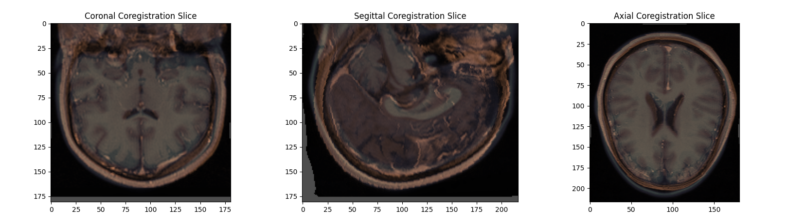
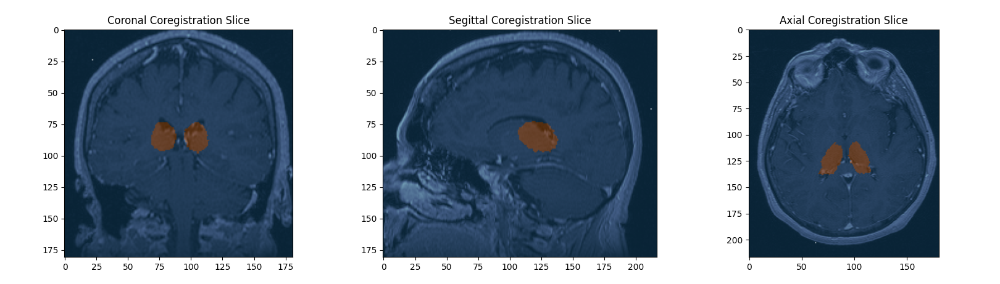

# DICOM Loading, Visualization and 3D coregistration

This project focuses on the comprehensive processing and analysis of medical imaging data, particularly CT (Computed Tomography) scans. Through a series of steps, we aim to enhance visualization, facilitate analysis, and extract valuable insights from these medical image files.


We meticulously arrange DICOM slices into a coherent 3D image and we perform an artifact removal for clarity. We use PyDICOM for file access and manipulation. Additionally, we segment images into liver, tumor, portal vein, and abdominal aorta classes, then fuse them using alpha fusion for enhanced visualization. We also perform 3D rigid coregistration of brain images, optimizing using the Nelder-Mead method and using quaternions for transformations to ensure alignment, enabling a more faithful and accurate visualization of the thalamus region.

## Index


- [Requirements](#requirements)
- [Project Structure](#project-structure)
- [Usage](#usage)
- [Analysis](#analysis)
- [Results](#results)
  - [3D animation with Liver and Tumor emphasized](#3d-animation-with-liver-and-tumor-emphasized)
  - [Coregistration of the Patient's brain and reference phantom brain.](#coregistration-of-the-patients-brain-and-reference-phantom-brain)
  - [Visualization of the Thalamus region in the patient's brain.](#visualization-of-the-thalamus-region-in-the-patients-brain)
  - [3D animation with Thalamus region emphasized on the patient's input space.](#3d-animation-with-thalamus-region-emphasized-on-the-patients-input-space)
- [Notes](#notes)
- [References](#references)

## Requirements

- Python 3.9.6
- pydicom 2.4.4
- numpy 1.26.4
- numpy-quaternion 2023.0.3
- matplotlib 3.8.3
- opencv-contrib-python 4.9.0.80
- pandas 2.1.1
- scipy 1.11.3

## Project structure

```
.
├── images
|   ├──
├── data_coregistration
|   ├── RM_Brain_3D-SPGR
|   |   ├── 000050.dcm
|   |   └── ... (211 DICOM files)
|   ├── AAL3_1mm.dcm
|   ├── AAL3_1mm.txt
|   ├── icbm_avg_152_t1_tal_nlin_symmetric_VI.dcm
|   └── Readme.txt
├── dicom_liver_files
|   ├── 2.000000-PRE LIVER-76970
|   |   ├── 1-03.dcm
|   |   └── ... (42 DICOM files)
|   └── 300.000000-Segmentation-99942
|       └── 1-1.dcm
├── src
|   ├── seg_animation_utils.py
|   ├── rigid_coregistration_utils.py
|   ├── main_seg_animation.py
|   └── main_rigid_coregistration.py
├── Documentation.pdf
├── LICENSE
├── README.md
└── presentation_slides.pdf
```

## Usage

- Install all the necessary requirements.
- Clone this repository.
- Download the files for the patient HCC_001 from this webpage: https://wiki.cancerimagingarchive.net/pages/viewpage.action?pageId=70230229 [1], and  Place the `2.000000-PRE LIVER-76970/` folder into the appropriate directory according to the project structure outlined above.


- Download all the data from this link https://drive.google.com/drive/folders/1gUdrNRapJaGf_L8nsAES6j4ipMWLJP4K [2], and again organize it according to the project structure.
- Finally, execute one of the main files based on your preference.


## Analysis

For further analysis of the project, please refer to the `Documentation.pdf`. This document was the report submitted for the final assigmnet of the Medical Image Processing course. Within it you will find:

- Explanations of the main ideas behind each part of the project.

- Which criteria has been used to construct the 3D image from DICOM files.


- Which optimization algorithm for coregistration has been used and why.

- How quaternions have been used to apply transformation for coregister two images.

- Findings and shortcomings.

Additionally, you can find visual guidance to understand the project in the `presentation_slides.pdf` file.


## Results

### 3D animation with Liver and Tumor emphasized.


In the following GIF, you can see the results of the  rearranged slices constructing the 3D body, with the liver highlighted in blue and the tumor in green, fused with alpha fusion.


### Coregistration of the Patient's brain and reference phantom brain.

In this figure, you can see a visual verification of the correct coregistration between the patient's input brain (copper-colored) and the reference brain (bone-colored). The middle slices of the coronal, sagittal, and axial planes are shown.



### Visualization of the Thalamus region in the patient's brain.

In the next figure, you can see the thalamus region on the patient's brain input space.  The middle slices of the coronal, sagittal, and axial planes are shown.



### 3D animation with Thalamus region emphasized on the patient's input space.

In the following GIF, you can see the results of the  rearranged slices constructing the 3D patient's brain, with the thalamus region depicted in orange.


## Notes

- Certain aspects, like artifact removal and image resizing, are hardcoded, limiting adaptability and requiring adjustments for other images.
- Optimization time is impractical for real-time usage, there is a need of faster iterations or alternative methods for processing.
- The visualization of the thalamus region in the input patient’s brain image is blocked by surrounding body tissues such as
flesh, bones, and skin. A desirable enhancement would be to selectively display the thalamus region within the patient’s brain, isolating it from surrounding , and non-relevant body parts.

## References

[1] Multimodality annotated HCC cases with and without advanced imaging segmentation: https://wiki.cancerimagingarchive.net/pages/viewpage.action?pageId=70230229

[2] Patient's brain and reference brain data: https://drive.google.com/drive/folders/1gUdrNRapJaGf_L8nsAES6j4ipMWLJP4K

[3] 11763 - Medical Image Processing, Programming Activities. Course. https://github.com/PBibiloni/11763
